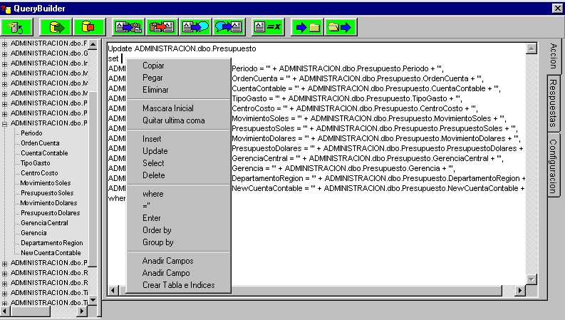



## SQL EsaySentence Creator

### Description

This SW allows you to create complex SQL sentences, working with the Dictionary of the Data Base in use. This sentences can be saved to use it later.

IMPORTANT:

This SW was made in Spanish. As I drop the source code, change it to English is easy.

Advances:

-Works like the ISQL command.

-You can select the number of records to be recalled, and the timeout.

-The response will be separated by ASCII 9. Pass it to an Excel Worksheet to work with the results.

-You can create the masks for: insert, select, update, delete of the tables.

-You have a create table/index template.

-The sentence can be converted to a string to pass it trough the clipboard onto your VB project.

-You have an internal buffer, to work with two 'clipboards'.
 
### More Info
 
-You will need the properly ODBC drivers installed.

-The sele.ini file MUST be on the sele executable file.

None.

             |
---                |---
**Submitted On**   |2000-04-18 16:01:24
**By**             |[Grenville Tryon](https://github.com/Planet-Source-Code/PSCIndex/blob/master/ByAuthor/grenville-tryon.md)
**Level**          |Advanced
**User Rating**    |5.0 (20 globes from 4 users)
**Compatibility**  |VB 5\.0, VB 6\.0
**Category**       |[Databases/ Data Access/ DAO/ ADO](https://github.com/Planet-Source-Code/PSCIndex/blob/master/ByCategory/databases-data-access-dao-ado__1-6.md)
**World**          |[Visual Basic](https://github.com/Planet-Source-Code/PSCIndex/blob/master/ByWorld/visual-basic.md)
**Archive File**   |[CODE\_UPLOAD49374182000\.zip](https://github.com/Planet-Source-Code/grenville-tryon-sql-esaysentence-creator__1-7374/archive/master.zip)

